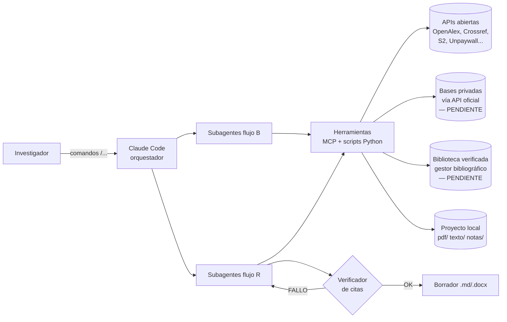

# 01 · Arquitectura

## Visión general



## Capas

| Capa | Qué es | Mecanismo en Claude Code |
|---|---|---|
| **Instrucciones** | Reglas globales y del proyecto | `CLAUDE.md` |
| **Orquestación** | Flujos invocables por el usuario | Skills / slash commands en `.claude/skills/` |
| **Agentes especializados** | Tareas con contexto propio | Subagentes en `.claude/agents/` |
| **Herramientas** | Acceso a fuentes y operaciones deterministas | Servidores MCP (`.mcp.json`) + scripts en `herramientas/` |
| **Guardarraíles** | Validaciones automáticas | Hooks en `.claude/settings.json` (p. ej. verificar citas antes de guardar un borrador) |
| **Datos** | Corpus, texto extraído, fichas, biblioteca | Carpeta **externa** configurable (ADR-0003), no dentro del repo |

**Por qué subagentes:** cada documento analizado consume mucho contexto. Delegar el análisis de cada
documento a un subagente que devuelve una *ficha estructurada* mantiene limpio el contexto del
orquestador y permite paralelizar.

**Por qué scripts además de MCP:** lo que debe ser reproducible y auditable (llamadas a APIs,
deduplicación, cálculo de relevancia, extracción PDF, verificación) va en código testeable; MCP
se usa cuando ya existe un servidor maduro (p. ej. para el gestor bibliográfico).

## Subagentes (decisión: 7, cada uno testeable por separado)

| Subagente | Tareas | Entrada → Salida |
|---|---|---|
| `buscador` | B1–B3 | pregunta + perfil → lista candidata rankeada (`candidatos.csv`) |
| `recuperador` | B4 | lista seleccionada → PDFs en `pdf/` + informe de no-disponibles |
| `lector` | B5 | 1 documento → ficha estructurada (`fichas/<id>.yaml`) |
| `rastreador` | B6 | fichas + referencias → nuevos candidatos (snowballing acotado) |
| `sintetizador` | B7 | fichas → estado de la cuestión + mapa de disputas/vacíos |
| `redactor` | R1–R2 | estado de la cuestión + objetivos + guía de revista → borrador |
| `verificador` | R3–R4 | borrador → informe de citas (OK / FALLO) — **sin permisos de escritura sobre el borrador** |

## Perfil disciplinar (configuración por proyecto)

Cada proyecto de investigación tendrá un `proyecto.yaml`. Borrador del esquema:

```yaml
nombre: ejemplo-proyecto
pregunta: "¿...?"
disciplina: humanidades | sociales | salud | ingenieria | mixta
idiomas: [es, en]
periodo: {desde: 2000, hasta: 2026}
fuentes: [openalex, crossref, semantic_scholar, pubmed]   # según disciplina
relevancia:
  pesos: {citas: 0.3, citas_por_anio: 0.3, centralidad_red: 0.3, recencia: 0.1}
limites:
  max_candidatos: 200
  max_lectura_completa: 40
  profundidad_snowballing: 2
estilo_cita: apa-7th-edition     # identificador CSL
revista_objetivo: null
```

## Estructura de repositorio objetivo

```
LoRu-Agent/
├── CLAUDE.md
├── README.md
├── .mcp.json                   # servidores MCP del proyecto        (fase 1+)
├── .claude/
│   ├── settings.json           # permisos + hooks                   (fase 1+)
│   ├── agents/                 # subagentes                         (fase 1+)
│   └── skills/                 # /estado-cuestion, /redactar, ...   (fase 1+)
├── herramientas/               # scripts Python deterministas      (fase 1+)
│   ├── fuentes/                # clientes API (openalex, crossref...)
│   ├── pdf/                    # extracción de texto + mapeo de páginas
│   ├── relevancia/             # ranking y grafo de citas
│   └── verificacion/           # verificador de citas
├── estilos/                    # CSL y guías de revistas
├── plantillas/                 # proyecto.yaml, ficha.yaml, informe
├── .env.ejemplo                # LORU_DATOS=~/Investigacion, claves de API  (fase 1+)
├── tests/
└── docs/
```

## Datos de un proyecto (fuera del repo)

El repositorio es la **herramienta**; los datos de cada investigación viven en una carpeta externa
definida por la variable `LORU_DATOS` en `.env` (por defecto `~/Investigacion`). Así:
- borrar o actualizar el clon no pierde trabajo;
- la carpeta puede sincronizarse (Drive, OneDrive, Nextcloud) y compartirse con el equipo;
- los PDFs con copyright nunca están cerca de git.

```
$LORU_DATOS/<proyecto>/
├── proyecto.yaml        # perfil
├── candidatos.csv       # B1–B3 (con puntuación y motivo)
├── seleccion.csv        # tras revisión humana
├── pdf/                 # B4
├── texto/               # texto extraído con marcas de página
├── fichas/              # B5: una ficha YAML por documento
├── grafo.json           # B6: red de citas
├── biblioteca.json      # CSL-JSON verificada (la única fuente de citas válida)
├── estado-cuestion.md   # B7
└── borradores/          # R1–R4 + informes de verificación
```

## Riesgos técnicos principales

| Riesgo | Mitigación |
|---|---|
| Consumo de contexto/coste con muchos documentos | Subagentes + fichas resumidas + límites en `proyecto.yaml` |
| Página PDF ≠ página impresa | Detección de desfase y marcas de página en el texto extraído (ver `05`) |
| PDFs escaneados | OCR con indicador de calidad; citas de OCR marcadas para revisión |
| Cobertura desigual por disciplina (libros, humanidades) | Múltiples fuentes + entrada manual a la biblioteca |
| Límites de uso de APIs | Caché local + respeto de rate limits + identificación (email) |
